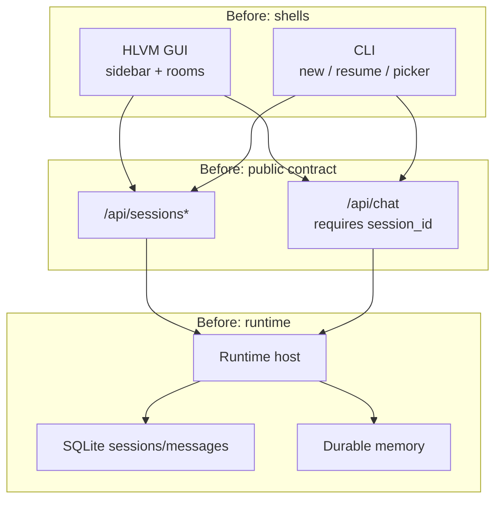
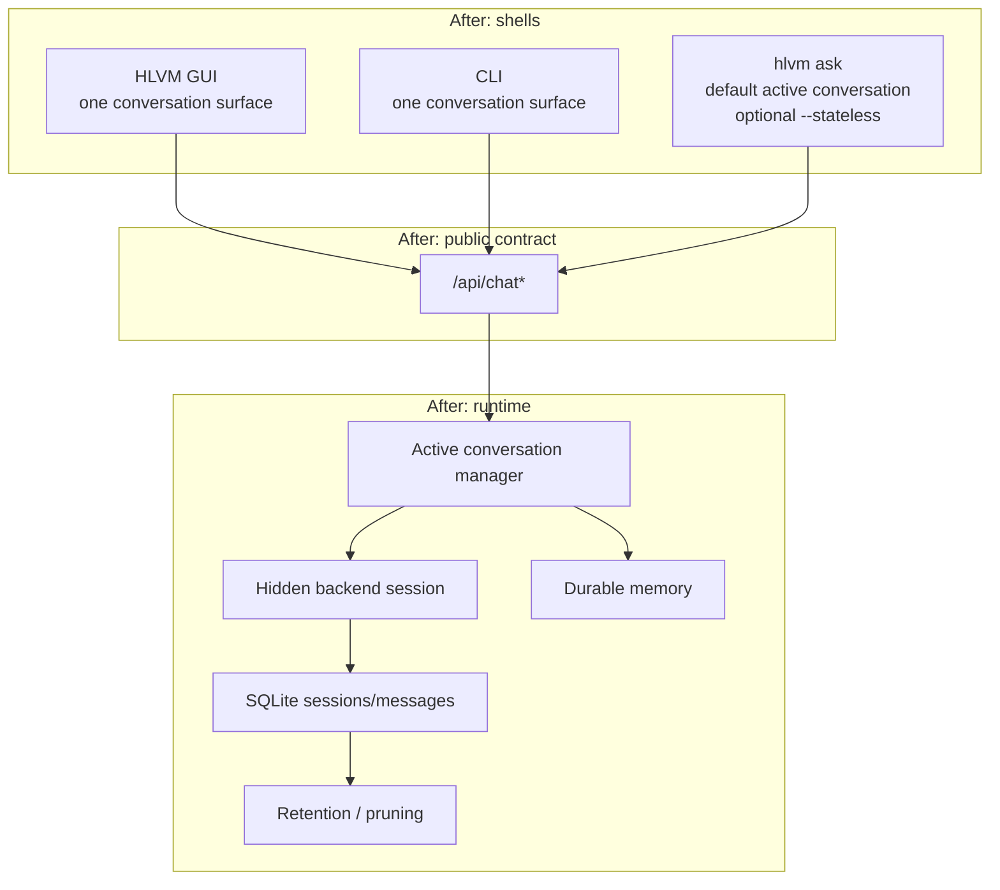
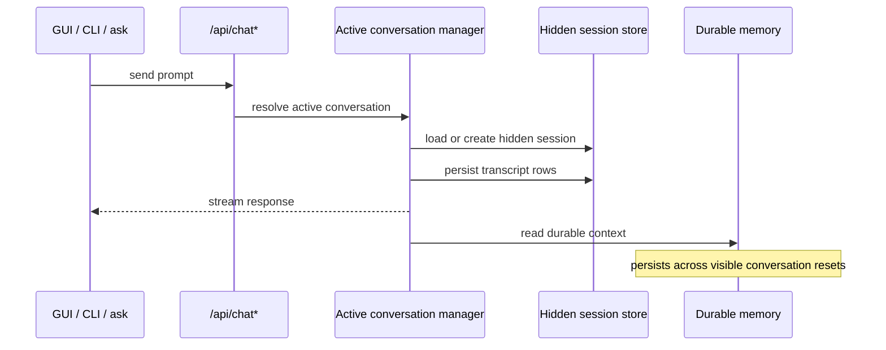

# One Global Assistant

## Status

This document describes the architecture and product model after the chat-room removal and active-conversation migration.

## TL;DR

HLVM no longer presents chat rooms, session pickers, or room switching as part of the normal user experience.

The product model is now:

- one assistant
- one visible conversation surface
- one daemon-owned active conversation by default
- hidden backend sessions as internal runtime/storage boundaries
- durable memory that persists across visible conversation resets

This is intentionally closer to a global assistant than to a workspace-bound coding transcript.

## Original goal

The original goal was to stop exposing backend session structure directly to users and shells.

We wanted:

- no visible chat-room model
- no sidebar room switching in the GUI
- no CLI picker / resume / new-session UX
- one consistent assistant concept across GUI and CLI
- one public active-conversation API instead of public session CRUD
- persistent memory that survives visible conversation resets

We did not want:

- one physically eternal transcript with no internal boundaries
- memory to become a replacement for transcript persistence
- the GUI to own lifecycle state that should belong to the runtime host

## Motivation

The old model had a structural mismatch between implementation and product intent.

At the runtime level, the system already had sessions as a useful internal abstraction.

At the shell level, that abstraction leaked into UX:

- the GUI presented sessions as chat rooms
- the CLI exposed new / resume / picker flows
- shells had to know too much about session identity and session lifecycle

That produced several problems:

- too much ceremony for a global assistant
- inconsistent GUI and CLI mental models
- room-transition bugs and stale-state flicker
- redundant session/room plumbing in shells
- public API surface that reflected storage shape instead of product intent

The migration fixes that by separating:

- product model
- runtime/storage model

## Before

### User-facing model

- GUI: sidebar of rooms, titles, switching, deletion
- CLI: explicit session lifecycle, picker, resume/new concepts
- Public API: session-shaped endpoints

### Runtime ownership

- shells participated in session selection and lifecycle
- the runtime persisted transcripts per session
- memory existed, but session UX still dominated the interaction model

### Before diagram

## After

### User-facing model

- GUI: one chat surface
- CLI: one chat surface
- Public API: `/api/chat*`
- No visible room/session lifecycle in normal UX

### Runtime ownership

- runtime host owns active conversation resolution
- runtime decides which hidden session backs the active conversation
- runtime retains/prunes old hidden transcripts
- durable memory remains separate and global

### After diagram

## Key architectural decision

The most important design decision was this:

- remove visible rooms from UX
- keep sessions as an internal backend abstraction

That distinction matters.

### Chat room

- user-facing UX concept
- titles
- switching
- CRUD
- sidebar

### Hidden backend session

- internal runtime boundary
- transcript persistence unit
- stream ownership unit
- cancellation unit
- optimistic versioning boundary
- retention/pruning unit

We intentionally removed the first and kept the second.

## Why we did not physically flatten everything into one eternal transcript

An eternal transcript sounds simpler, but it is worse as a runtime boundary.

It would make these things harder:

- cancellation
- streaming ownership
- transcript retention
- crash recovery
- debugability
- bounded context management

If we deleted sessions entirely, we would still need to reinvent the same boundary under another name.

So the correct move was:

- one visible assistant surface
- hidden session-backed runtime underneath

## Public API change

### Before

- `/api/sessions`
- `/api/sessions/:id`
- `/api/sessions/:id/messages`
- `/api/sessions/:id/stream`
- `/api/sessions/:id/cancel`
- `/api/chat` with public `session_id` usage

### After

- `/api/chat`
- `/api/chat/messages`
- `/api/chat/messages/:messageId`
- `/api/chat/stream`
- `/api/chat/cancel`
- `/api/chat/interaction`

The runtime still accepts internal session context where needed, but session identity is no longer the normal public lifecycle tool for shells.

## CLI and GUI alignment

One of the main goals was consistency.

### Before

- GUI behaved like a room-based chat app
- CLI behaved like a resumable session-oriented REPL
- both were talking to the same runtime, but with different user models

### After

- both shells present one assistant
- both use the active-conversation contract
- both stop surfacing session management as normal interaction

This gives the product one coherent mental model instead of two partially competing ones.

## Relationship to memory

Memory is not transcript history.

That distinction is critical.

### Transcript

- exact turns
- ordered chronology
- tool activity context
- response text
- session-scoped persistence
- hidden and pruneable

### Durable memory

- extracted facts
- stable user preferences
- enduring context worth carrying forward
- global and persistent
- not a chronological replay log

### How the model works now

- the visible conversation can reset
- the hidden transcript backing it can change
- durable memory persists across those resets
- the assistant still feels continuous because the right facts survive
- the transcript does not need to remain permanently visible for continuity to exist

## Why this is closer to a global assistant than to Claude Code

Claude Code is optimized for a different primary experience:

- explicit coding sessions
- workspace/task orientation
- transcript continuity as a first-class surface
- visible operational session semantics

HLVM's global assistant direction is different:

- user-centric, not transcript-centric
- ambient and low-ceremony
- less "manage the conversation"
- more "talk to the assistant"

That is why "Siri done right" is a useful phrase here.

Not because HLVM is simple or shallow, but because the interaction should feel:

- immediate
- global
- consistent
- low-friction

while still being:

- agentic
- tool-capable
- memory-aware
- technically grounded

## Request flow

## `hlvm ask` behavior

`hlvm ask` now follows the same general model as the other shells.

### Default

- uses the active conversation
- does not create a public session lifecycle surface

### `--stateless`

- creates an isolated hidden session for that request only
- does not rebind the daemon's active conversation
- is useful for one-shot asks without mutating the visible conversation state

This preserves one consistent public model while still allowing an explicit isolation path.

## What this migration removed

- visible chat rooms
- sidebar room navigation
- room CRUD
- session picker UX
- resume/new public session workflows in normal CLI chat
- public session CRUD endpoints
- public session stream/channel for shell UX
- shell-side room/session lifecycle ownership

## What this migration kept

- hidden session-backed transcript storage
- durable memory
- agent runtime features
- tool execution
- attachment and reference handling
- cancellation and streaming
- retention and pruning

## Practical before vs after summary

| Area | Before | After |
| --- | --- | --- |
| GUI | Room sidebar and switching | One visible conversation |
| CLI | Session-oriented chat UX | One visible conversation |
| Public API | Session-shaped | Active-conversation-shaped |
| Runtime ownership | Split between shell and host | Host-owned |
| Transcript persistence | Publicly session-addressed | Hidden session-backed |
| Memory | Present, but overshadowed by session UX | Global assistant continuity layer |
| User mental model | Manage rooms/sessions | Talk to one assistant |

## Final product definition

HLVM should now be understood as:

- a global assistant
- with one visible conversation surface
- backed by hidden internal sessions
- informed by durable memory
- consistent across GUI and CLI

That is the core outcome of this migration.
